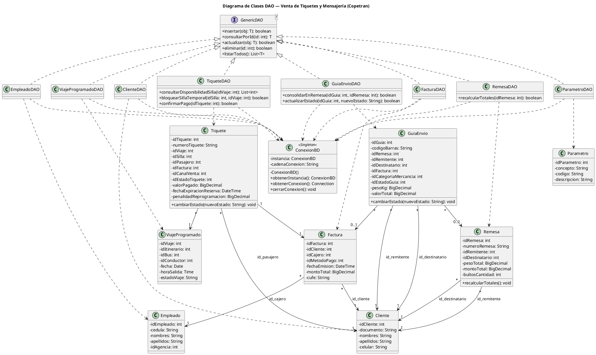
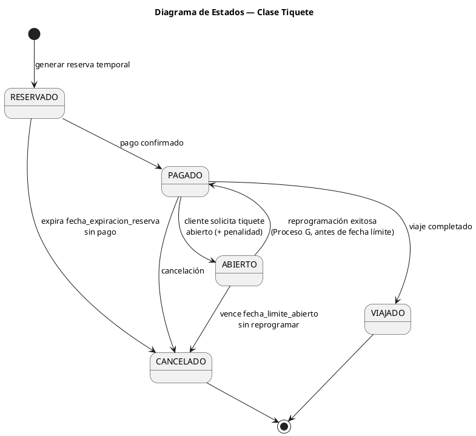
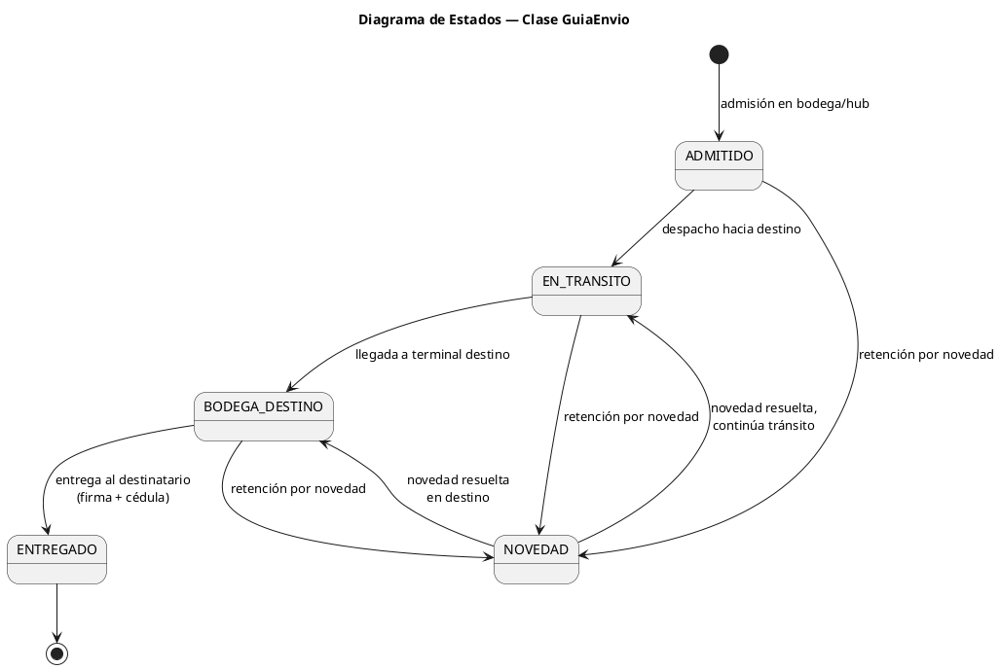
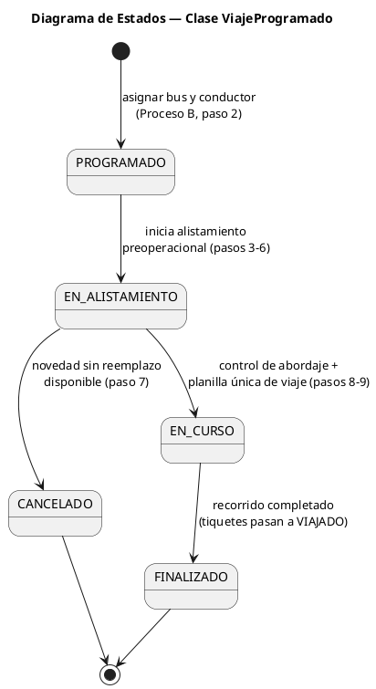
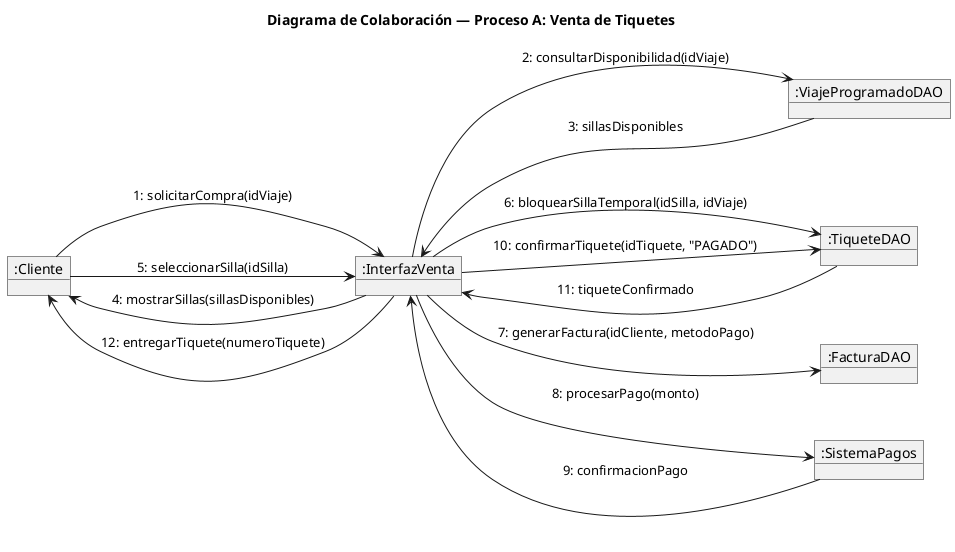
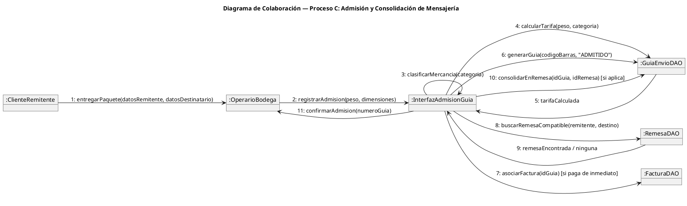
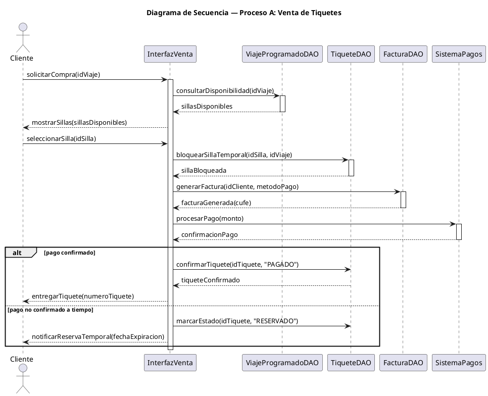
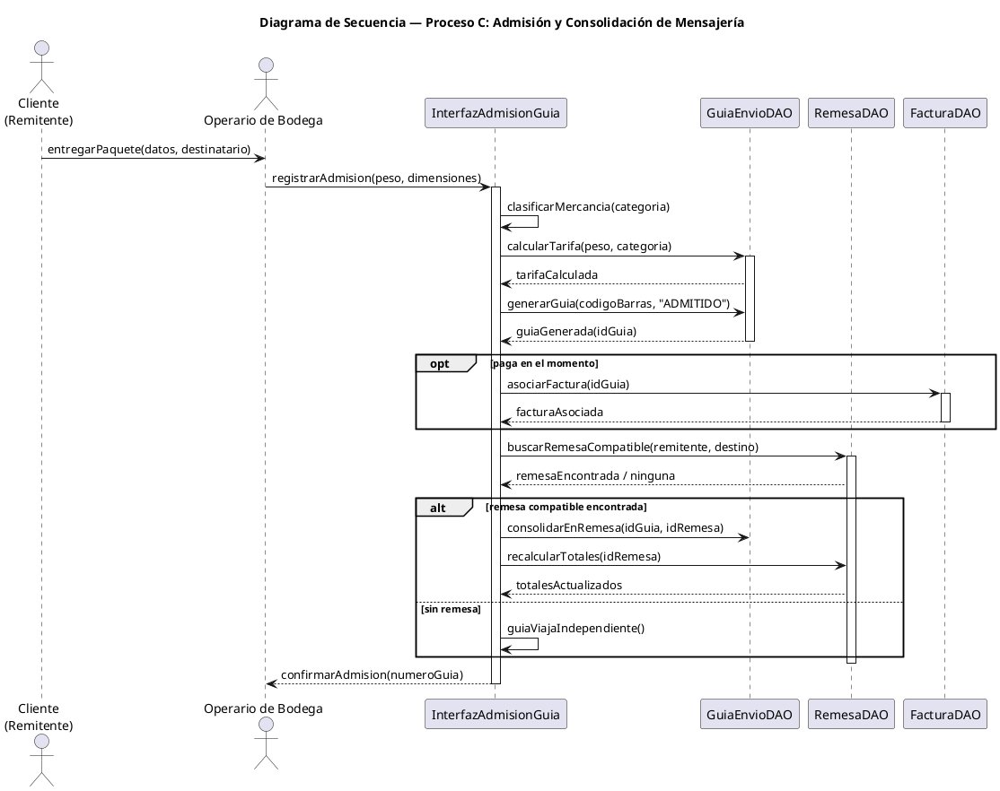

# Parcial Primer Corte — Diseño de Interfaz de Usuario (Copetran)

**Curso:** Patrones de Diseño de Software (SIST0076-G02) — Universidad Sergio Arboleda
**Entregable:** Parcial primer corte (distinto de CR-1 T-2 Formulación de Proyecto; mismo caso Copetran)
**Vence:** 7 de septiembre de 2026, 23:59
**Repo de trabajo:** `github.com/SKing25/Copetran-`

Este documento es la fuente de verdad para este entregable específico. Está construido 100% a partir
de `cr1_t2_formulacion_proyecto.tex/.pdf`, `copetran_corregido_SCHEMA_BASE.sql`, `Diagrama_proyecto.pdf`
y `copetran_correcciones_criticas_v2.sql` (el paquete de contexto del proyecto Copetran ya existente),
para mantener trazabilidad total con lo ya entregado en CR-1 T-2. No inventa entidades, estados ni roles
que no estén ya en esos documentos.

---

## 0. Componentes pedidos (consigna del parcial)

1. Roles del sistema
2. Casos de uso de alto nivel
3. Dos procesos principales (elegidos)
4. Dos casos de uso extendidos
5. Dos formatos de especificación de caso de uso
6. Diagrama de clases DAO
7. Diagrama de estados para tres clases principales
8. Diagramas de colaboración (uno por proceso)
9. Diagramas de secuencia (uno por proceso)

Terminología según las diapositivas del docente (`SEM 04 1 METODOLOGIAS RUP.pdf`): "Modelo de casos de
uso de alto nivel UML V-2 — por rol", "Modelo de casos de uso extendido — por proceso", "Diagrama de
clases DAO (Data Access Object)", "Diagrama de Estados", "Diagrama de COLABORACIÓN", "Diagrama de
SECUENCIA — por proceso".

---

## 1. Roles del sistema (actores)

### Actores primarios (operan la interfaz del sistema)

| Rol / Actor | Ubicación en el organigrama | Interviene en |
|---|---|---|
| Cajero de Agencia | Dirección de Operaciones y Pasajes — Comercial y Taquillas | Venta de tiquetes (A), reprogramación (G), registro de cliente (M) |
| Auxiliar de Despacho | Dirección de Operaciones y Pasajes — Rodamiento y Despacho | Control de abordaje, cierre de tiquete VIAJADO/CANCELADO (A, B) |
| Operario de Bodega | Dirección de Logística y Carga — Gestión de Bodegas y Hubs | Admisión y consolidación de mensajería (C), registro de cliente (M) |
| Conductor de Vehículo de Reparto | Dirección de Logística y Carga — Distribución y Rutas de Carga | Distribución de última milla (H) |
| Analista de RRHH | Dirección de RRHH y Nómina — Contratos y Licencias | Contratación (E) |
| Área de Nómina y Novedades | Dirección de RRHH y Nómina | Liquidación de nómina (E) |
| Técnico Mecánico | Dirección de Operaciones y Pasajes — Mantenimiento de Flota | Mantenimiento y alta de flota (D, F) |
| Inspector Técnico / Auxiliar de Laboratorio | Dirección de Operaciones y Pasajes — Seguridad Vial y Control | Alistamiento preoperacional (B) |
| Monitorista de Telemetría | Dirección de Tecnología TIC — Centro de Control GPS e IoT | Monitoreo GPS/IoT (J) |
| Técnico de Incidencias (Mesa de Ayuda) | Dirección de Tecnología TIC | Gestión de incidencias TIC (I) |
| Administrador de Servidores | Dirección de Tecnología TIC — Infraestructura y Ciberseguridad | Infraestructura y ciberseguridad (O) |
| Gerencia General / Direcciones | Transversal | Aprobación de rutas (K), gestión organizacional (L) |
| Auditoría Interna | Standalone, reporta a Gerencia | Verificación documental (B), trazabilidad (RNF06) |

### Actores secundarios / externos

| Rol / Actor | Naturaleza | Interviene en |
|---|---|---|
| Cliente (Pasajero / Remitente / Destinatario) | Externo, humano | Compra de tiquetes (A, canal WEB/APP), envío de mensajería (C) |
| Sistema de Pagos | Externo, sistema | Confirmación de pago (efectivo, débito, crédito, transferencia/QR) |
| Sistema de Facturación Electrónica (DIAN) | Externo, sistema | Emisión de CUFE (RF04, RNF07) |

Nota de alcance: se listan los 22 grupos de cargo ya documentados en la Sección 6 del CR-1 T-2 como
base; para este parcial se consolidan en los roles anteriores porque son los que efectivamente operan
pantallas o son actores de caso de uso — coherente con RNF01 (control de acceso por cargo).

---

## 2. Casos de uso de alto nivel (por rol)

- **Cliente:** Comprar Tiquete, Consultar Disponibilidad de Viaje, Reprogramar Tiquete Abierto, Cancelar
  Tiquete, Enviar Encomienda, Consultar Estado de Envío.
- **Cajero de Agencia:** Vender Tiquete, Emitir Factura, Reprogramar Tiquete, Registrar Cliente.
- **Auxiliar de Despacho:** Controlar Abordaje, Generar Planilla Única de Viaje, Cerrar Estado de Viaje.
- **Operario de Bodega:** Admitir Guía de Envío, Clasificar Mercancía, Consolidar Remesa, Actualizar
  Estado de Guía.
- **Conductor de Vehículo de Reparto:** Confirmar Entrega de Última Milla.
- **Analista de RRHH:** Registrar Empleado, Crear Contrato, Registrar Licencia de Conducción.
- **Área de Nómina y Novedades:** Registrar Novedad, Liquidar Nómina.
- **Técnico Mecánico:** Registrar Mantenimiento, Registrar Cambio de Placa, Dar de Alta un Bus.
- **Inspector Técnico / Auxiliar de Laboratorio:** Registrar Inspección Preoperacional, Registrar Prueba
  de Alcoholemia.
- **Monitorista de Telemetría:** Monitorear Dispositivo IoT, Generar Alerta de Desconexión.
- **Técnico de Incidencias:** Registrar Incidencia TIC, Cerrar Incidencia.
- **Administrador de Servidores:** Ejecutar Copia de Respaldo, Aplicar Parches de Seguridad.
- **Gerencia General:** Aprobar Apertura de Ruta/Agencia, Gestionar Estructura Organizacional.
- **Auditoría Interna:** Verificar Documentación de Vehículo/Conductor, Consultar Historial Auditable.

---

## 3. Procesos principales elegidos

**Proceso A — Venta de tiquetes de pasajeros** y **Proceso C — Admisión y consolidación de mensajería en
bodega** (numeración original del CR-1 T-2, Sección 5).

Justificación (para que quede explícita en el documento entregable):

1. Cubren las **dos líneas de negocio** de Copetran (pasajeros y carga/mensajería), no solo una — el
   criterio pedido de máxima cobertura ("lo más abarcativo posible").
2. Son los **dos procesos con estados parametrizados más ricos** del modelo: `ESTADO_TIQUETE` (5 estados)
   y `ESTADO_GUIA` (5 estados), ideales para el diagrama de estados pedido.
3. Ya están **documentados paso a paso con rol responsable** en el CR-1 T-2 (Secciones 5.1 y 5.3), lo que
   garantiza trazabilidad exacta entre este parcial y el entregable grande del curso.
4. Tienen **requerimientos funcionales y hallazgos de auditoría ya trabajados** (RF03/RF04 para A;
   RF05/RF11/RF17 para C), lo que da contenido real para las reglas de negocio de las especificaciones de
   caso de uso, en lugar de inventarlas desde cero.

---

## 4. Casos de uso extendidos

### CUE-01 — Comprar Tiquete de Pasajero (Proceso A)

- **Actor principal:** Cajero de Agencia (canal TAQUILLA) / Cliente (canal WEB o APP)
- **Actores secundarios:** Sistema de Pagos, Auxiliar de Despacho
- **`<<include>>` Consultar Disponibilidad de Silla** — siempre se ejecuta antes de vender.
- **`<<include>>` Generar Factura** — siempre se ejecuta al confirmar la venta.
- **`<<extend>>` Reservar Tiquete Sin Pago Inmediato** — extiende el caso base cuando el cliente pide
  reserva temporal (estado `RESERVADO`, con `fecha_expiracion_reserva`).
- **`<<extend>>` Habilitar Tiquete Abierto** — extiende el caso base cuando el pago se confirma pero el
  cliente pide viajar en fecha flexible (estado `ABIERTO`, con `penalidad_reprogramacion`).
- **`<<extend>>` Reprogramar Tiquete Abierto** (Proceso G) — extiende cuando existe un tiquete en estado
  `ABIERTO` dentro de la fecha límite.

### CUE-02 — Admitir y Consolidar Guía de Envío (Proceso C)

- **Actor principal:** Operario de Bodega
- **Actores secundarios:** Cliente (Remitente), Sistema de Facturación Electrónica
- **`<<include>>` Clasificar Mercancía** — siempre se ejecuta (categoría: general, perecedera, frágil,
  documentos/valores).
- **`<<include>>` Calcular Tarifa de Envío** — siempre se ejecuta antes de generar la guía.
- **`<<extend>>` Asociar Guía a Factura Inmediata** — extiende cuando el envío se paga en el momento de la
  admisión.
- **`<<extend>>` Consolidar en Remesa** — extiende cuando la guía comparte remitente/destino con otras
  guías pendientes.
- **`<<extend>>` Marcar Guía con Novedad** — extiende el flujo de seguimiento cuando el envío queda
  retenido (estado `NOVEDAD`).

---

## 5. Especificación de casos de uso (formato completo)

### ECU-01 — Comprar Tiquete de Pasajero

| Campo | Contenido |
|---|---|
| **ID** | ECU-01 |
| **Nombre** | Comprar Tiquete de Pasajero |
| **Actor(es)** | Cliente (principal en canal WEB/APP), Cajero de Agencia (principal en canal TAQUILLA), Sistema de Pagos (secundario) |
| **Descripción** | Permite registrar la venta de un tiquete para un viaje programado, bloqueando la silla seleccionada, generando la factura y confirmando el pago. |
| **Precondiciones** | Existe al menos un `VIAJE_PROGRAMADO` con sillas disponibles; el cliente está registrado o se registra en el paso 2 (Proceso M). |
| **Postcondiciones** | Se crea un `TIQUETE` en estado `PAGADO` (o `RESERVADO`/`ABIERTO` según flujo alterno) asociado a una `FACTURA`; la silla queda ocupada para ese viaje (`UNIQUE(id_viaje, id_silla)`, RF01). |
| **Flujo principal** | 1. Consultar disponibilidad de sillas del viaje. 2. Seleccionar silla y registrar/reutilizar datos del cliente. 3. Definir canal de venta (TAQUILLA, WEB, APP). 4. Bloquear la silla temporalmente (RF03, p. ej. 3 minutos) para evitar condición de carrera entre canales. 5. Emitir factura (cliente, cajero, método de pago). 6. Confirmar recepción del pago. 7. Confirmar tiquete como `PAGADO`. |
| **Flujos alternativos** | **A1 (Reserva sin pago inmediato):** en el paso 6 el cliente no paga de inmediato — el tiquete queda en `RESERVADO` con `fecha_expiracion_reserva`; si vence sin pago, se libera la silla. **A2 (Tiquete abierto):** en el paso 7 el cliente solicita flexibilidad de fecha — estado `ABIERTO` con `penalidad_reprogramacion`. **A3 (Cancelación):** el Auxiliar de Despacho marca el tiquete como `CANCELADO` si no se usa. |
| **Reglas de negocio** | RF03 (bloqueo temporal de silla, un tiquete por silla por viaje), RF04 (factura debe emitir CUFE), 5 estados y 3 canales parametrizados en `MULTITABLA_PARAMETRO`. |
| **Frecuencia de uso** | Alta — varias veces por minuto en horas pico, por agencia. |

### ECU-02 — Admitir y Consolidar Guía de Envío

| Campo | Contenido |
|---|---|
| **ID** | ECU-02 |
| **Nombre** | Admitir y Consolidar Guía de Envío |
| **Actor(es)** | Operario de Bodega (principal), Cliente/Remitente (secundario), Sistema de Facturación (secundario) |
| **Descripción** | Permite admitir un paquete en bodega, clasificarlo, generar su guía con código de barras y, si aplica, consolidarlo en una remesa. |
| **Precondiciones** | El remitente y el destinatario están registrados o se registran en el momento (Proceso M). |
| **Postcondiciones** | Se crea una `GUIA_ENVIO` en estado `ADMITIDO`, con o sin `id_remesa` asociado; si se paga en el momento, queda asociada a una `FACTURA`. |
| **Flujo principal** | 1. Admisión: registrar remitente, destinatario, pesaje y dimensionamiento. 2. Clasificar mercancía (general, perecedera, frágil, documentos/valores). 3. Calcular tarifa y generar guía con código de barras (estado `ADMITIDO`). 4. Recepción en bodega/hub, con control de capacidad/temperatura si aplica. 5. Consolidar en remesa si comparte remitente/destino con otras guías pendientes. 6. Actualizar estado a lo largo del ciclo: `EN_TRANSITO` → `BODEGA_DESTINO` → `ENTREGADO`. |
| **Flujos alternativos** | **A1 (Pago inmediato):** en el paso 3, si el envío se paga al momento, se asocia `id_factura`. **A2 (Envío sin remesa):** en el paso 5, una guía puede viajar sin consolidarse en remesa. **A3 (Novedad):** en cualquier punto del paso 6, el estado puede pasar a `NOVEDAD` si el envío queda retenido. |
| **Reglas de negocio** | RF05 (cálculo automático de valor según peso/categoría, seguimiento de estado), RF11 (hallazgo: el modelo aún no registra qué empleado ejecuta la admisión — pendiente de corrección), RF17 (los totales de la remesa deben recalcularse a partir de sus guías — pendiente de trigger, ver auditoría CR-1 T-2 Sección 14.6). |
| **Frecuencia de uso** | Alta — continua durante horario operativo, por bodega/hub. |

---

## 6. Diagrama de clases DAO

Archivo: `docs/parcial-primer-corte/diagramas/clases-dao/clases-dao.puml`

---

## 7. Diagramas de estados (tres clases principales)

### 7.1 Clase `Tiquete` (`ESTADO_TIQUETE`)

`docs/parcial-primer-corte/diagramas/estados/estado-tiquete.puml`

### 7.2 Clase `GuiaEnvio` (`ESTADO_GUIA`)

`docs/parcial-primer-corte/diagramas/estados/estado-guia-envio.puml`

### 7.3 Clase `ViajeProgramado` (`estado_viaje`)

`docs/parcial-primer-corte/diagramas/estados/estado-viaje-programado.puml`

Nota: en el modelo relacional actual `estado_viaje` es texto libre (hallazgo de normalización, CR-1 T-2
Sección 14.6). Este diagrama formaliza el comportamiento real descrito en el Proceso B, y sirve como
insumo para migrar el campo a `MULTITABLA_PARAMETRO` en una futura iteración.

---

## 8. Diagramas de colaboración (uno por proceso)

PlantUML no tiene un tipo nativo "diagrama de comunicación/colaboración"; se representa como diagrama de
objetos con mensajes numerados sobre los enlaces (técnica estándar UML2 para aproximar un diagrama de
colaboración en PlantUML).

### 8.1 Proceso A — Venta de tiquetes

`docs/parcial-primer-corte/diagramas/colaboracion/colaboracion-venta-tiquetes.puml`

### 8.2 Proceso C — Admisión y consolidación de mensajería

`docs/parcial-primer-corte/diagramas/colaboracion/colaboracion-admision-mensajeria.puml`

---

## 9. Diagramas de secuencia (uno por proceso)

### 9.1 Proceso A — Venta de tiquetes

`docs/parcial-primer-corte/diagramas/secuencia/secuencia-venta-tiquetes.puml`

### 9.2 Proceso C — Admisión y consolidación de mensajería

`docs/parcial-primer-corte/diagramas/secuencia/secuencia-admision-mensajeria.puml`

---

## 10. Notas de trazabilidad y pendientes a mencionar en el documento final

- El diagrama de estados de `ViajeProgramado` formaliza un campo que hoy es texto libre en la base de
  datos (hallazgo de normalización, CR-1 T-2 Sección 14.6) — vale la pena mencionarlo explícitamente como
  aporte de este parcial.
- ECU-02 hereda el hallazgo RF11 (falta `id_empleado` en `GUIA_ENVIO`) y RF17 (falta trigger de recálculo
  de totales en `REMESA`) — el diagrama de clases DAO ya incluye `recalcularTotales()` como método
  propuesto en `RemesaDAO`/`Remesa`, coherente con la corrección pendiente documentada en CR-1 T-2.
- Este documento y sus diagramas son un entregable **aparte** de `cr1_t2_formulacion_proyecto.tex`; no
  reemplazan ni deben fusionarse con ese archivo salvo que el equipo decida lo contrario más adelante.
