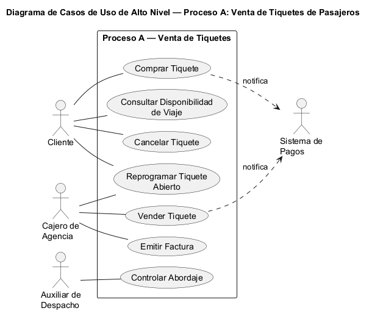
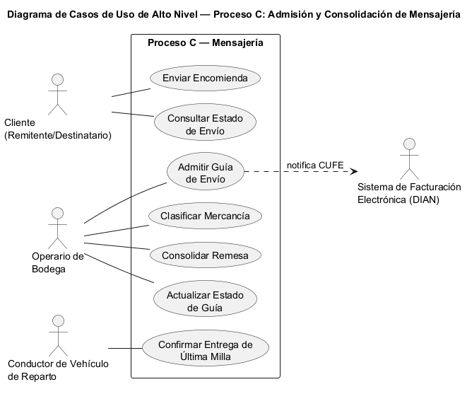

# 2. Casos de uso de alto nivel (por rol)

> Extraído de [00-brief.md](00-brief.md), Sección 2. Modelo de casos de uso de alto nivel UML V-2 — por
> rol, según terminología del docente (`SEM 04 1 METODOLOGIAS RUP.pdf`).

- **Cliente:** Comprar Tiquete, Consultar Disponibilidad de Viaje, Reprogramar Tiquete Abierto, Cancelar
  Tiquete, Enviar Encomienda, Consultar Estado de Envío.
- **Cajero de Agencia:** Vender Tiquete, Emitir Factura, Reprogramar Tiquete, Registrar Cliente.
- **Auxiliar de Despacho:** Controlar Abordaje, Generar Planilla Única de Viaje, Cerrar Estado de Viaje.
- **Operario de Bodega:** Admitir Guía de Envío, Clasificar Mercancía, Consolidar Remesa, Actualizar
  Estado de Guía.
- **Conductor de Vehículo de Reparto:** Confirmar Entrega de Última Milla.
- **Analista de RRHH:** Registrar Empleado, Crear Contrato, Registrar Licencia de Conducción.
- **Área de Nómina y Novedades:** Registrar Novedad, Liquidar Nómina.
- **Técnico Mecánico:** Registrar Mantenimiento, Registrar Cambio de Placa, Dar de Alta un Bus.
- **Inspector Técnico / Auxiliar de Laboratorio:** Registrar Inspección Preoperacional, Registrar Prueba
  de Alcoholemia.
- **Monitorista de Telemetría:** Monitorear Dispositivo IoT, Generar Alerta de Desconexión.
- **Técnico de Incidencias:** Registrar Incidencia TIC, Cerrar Incidencia.
- **Administrador de Servidores:** Ejecutar Copia de Respaldo, Aplicar Parches de Seguridad.
- **Gerencia General:** Aprobar Apertura de Ruta/Agencia, Gestionar Estructura Organizacional.
- **Auditoría Interna:** Verificar Documentación de Vehículo/Conductor, Consultar Historial Auditable.

## Diagramas gráficos (por proceso elegido)

Representación gráfica UML de los casos de uso de alto nivel correspondientes a los dos procesos
elegidos en [03-procesos-principales.md](03-procesos-principales.md).

### Proceso A — Venta de Tiquetes de Pasajeros

### Proceso C — Admisión y Consolidación de Mensajería

