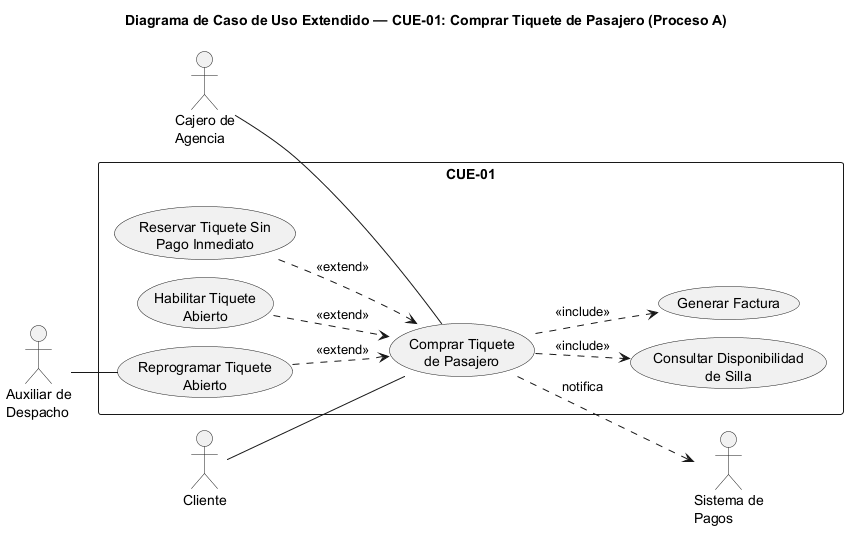
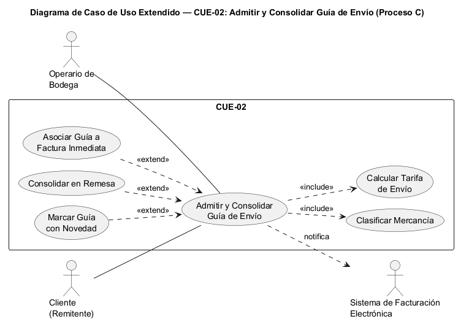

# 4. Casos de uso extendidos

> Extraído de [00-brief.md](00-brief.md), Sección 4. Modelo de casos de uso extendido — por proceso.

## CUE-01 — Comprar Tiquete de Pasajero (Proceso A)

- **Actor principal:** Cajero de Agencia (canal TAQUILLA) / Cliente (canal WEB o APP)
- **Actores secundarios:** Sistema de Pagos, Auxiliar de Despacho
- **`<<include>>` Consultar Disponibilidad de Silla** — siempre se ejecuta antes de vender.
- **`<<include>>` Generar Factura** — siempre se ejecuta al confirmar la venta.
- **`<<extend>>` Reservar Tiquete Sin Pago Inmediato** — extiende el caso base cuando el cliente pide
  reserva temporal (estado `RESERVADO`, con `fecha_expiracion_reserva`).
- **`<<extend>>` Habilitar Tiquete Abierto** — extiende el caso base cuando el pago se confirma pero el
  cliente pide viajar en fecha flexible (estado `ABIERTO`, con `penalidad_reprogramacion`).
- **`<<extend>>` Reprogramar Tiquete Abierto** (Proceso G) — extiende cuando existe un tiquete en estado
  `ABIERTO` dentro de la fecha límite.

## CUE-02 — Admitir y Consolidar Guía de Envío (Proceso C)

- **Actor principal:** Operario de Bodega
- **Actores secundarios:** Cliente (Remitente), Sistema de Facturación Electrónica
- **`<<include>>` Clasificar Mercancía** — siempre se ejecuta (categoría: general, perecedera, frágil,
  documentos/valores).
- **`<<include>>` Calcular Tarifa de Envío** — siempre se ejecuta antes de generar la guía.
- **`<<extend>>` Asociar Guía a Factura Inmediata** — extiende cuando el envío se paga en el momento de la
  admisión.
- **`<<extend>>` Consolidar en Remesa** — extiende cuando la guía comparte remitente/destino con otras
  guías pendientes.
- **`<<extend>>` Marcar Guía con Novedad** — extiende el flujo de seguimiento cuando el envío queda
  retenido (estado `NOVEDAD`).

